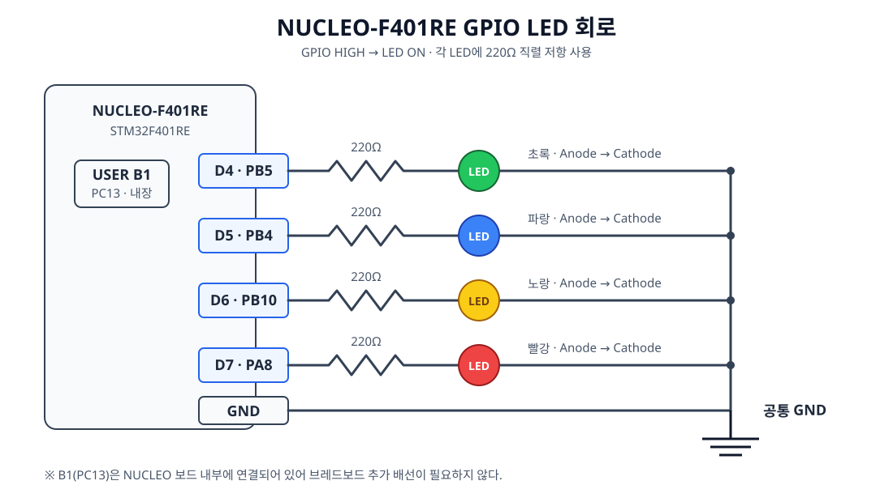

# STM32 GPIO 학습 기록

## GPIO란?

GPIO는 `General Purpose Input/Output`의 약자로, **범용 입출력 핀**을 의미한다. MCU가 외부 장치와 디지털 신호를 주고받을 때 사용하는 가장 기본적인 인터페이스다.

STM32와 같은 MCU는 GPIO를 통해 LED, 버튼, 센서, 릴레이, 모터 드라이버 등의 외부 장치와 연결된다.

```text
LED · 버튼 · 센서 · 릴레이 · 모터 드라이버
                    ↕
                  GPIO
                    ↕
                   MCU
```

### GPIO의 기본 구조

GPIO의 동작은 신호 방향에 따라 `Input`과 `Output`으로 구분한다.

| 구분 | 역할 | 신호 방향 |
|---|---|---|
| `Input` | 버튼이나 센서 등의 외부 신호 읽기 | 외부 → MCU |
| `Output` | LED나 릴레이 등의 외부 장치 제어 | MCU → 외부 |

```text
Input : 버튼·센서 → GPIO → MCU
Output: MCU → GPIO → LED·릴레이
```

### GPIO Output

GPIO Output은 MCU에서 외부 장치로 `HIGH` 또는 `LOW` 신호를 출력하는 방식이다. 현재 프로젝트에서는 LED를 제어할 때 사용했다.

```c
/* GPIO 출력을 HIGH로 변경 */
HAL_GPIO_WritePin(GPIOA, GPIO_PIN_5, GPIO_PIN_SET);

/* GPIO 출력을 LOW로 변경 */
HAL_GPIO_WritePin(GPIOA, GPIO_PIN_5, GPIO_PIN_RESET);
```

현재 LED 회로에서는 `SET`일 때 LED가 켜지고 `RESET`일 때 꺼진다.

### GPIO Input

GPIO Input은 버튼이나 센서에서 발생한 디지털 신호를 MCU가 읽는 방식이다. 현재 프로젝트에서는 PC13에 연결된 사용자 버튼의 상태를 읽을 때 사용했다.

```c
GPIO_PinState state;

state = HAL_GPIO_ReadPin(GPIOC, GPIO_PIN_13);
```

반환값은 `GPIO_PIN_SET` 또는 `GPIO_PIN_RESET`이며 조건문으로 입력 상태를 판단할 수 있다.

```c
if (HAL_GPIO_ReadPin(GPIOC, GPIO_PIN_13) == GPIO_PIN_SET)
{
    /* 버튼 입력 처리 */
}
```

### HIGH와 LOW

GPIO는 기본적으로 두 가지 논리 상태를 사용하는 디지털 신호다.

| 상태 | 논리값 | 전압의 의미 |
|---|---:|---|
| `HIGH` | 1 | 높은 전압 상태 |
| `LOW` | 0 | 낮은 전압 상태 |

3.3V MCU에서는 개념적으로 `HIGH`는 3.3V에 가까운 상태, `LOW`는 0V에 가까운 상태다. 다만 실제로 HIGH와 LOW를 판정하는 전압 범위는 MCU 데이터시트에서 확인해야 한다.

### GPIO Port와 Pin

STM32의 GPIO는 `PA0`, `PA5`, `PB3`, `PC13`처럼 Port와 Pin 번호를 조합해 표현한다.

`PA5`는 다음과 같은 의미다.

| 표기 | 의미 |
|---|---|
| `P` | Port |
| `A` | Port A |
| `5` | Pin 5 |

하나의 GPIO Port에는 여러 Pin이 포함된다.

```text
GPIOA
├── PA0
├── PA1
├── PA2
├── PA3
├── PA4
└── PA5
```

STM32 HAL에서는 Port와 Pin을 각각 전달해 제어한다.

```c
HAL_GPIO_WritePin(GPIOA, GPIO_PIN_5, GPIO_PIN_SET);
```

### Pull-up, Pull-down과 Floating

입력 핀에 HIGH나 LOW를 만들어 주는 신호가 없으면 입력 상태가 불확실해질 수 있다. 이를 `Floating` 상태라고 한다.

- `Pull-up`: 저항을 통해 입력의 기본 상태를 `HIGH`로 유지한다.
- `Pull-down`: 저항을 통해 입력의 기본 상태를 `LOW`로 유지한다.

일반적인 Pull-up 버튼 회로에서는 버튼을 놓았을 때 `HIGH`, 눌렀을 때 GND와 연결되어 `LOW`가 된다.

| Pull-up 버튼 상태 | GPIO 입력 |
|---|---|
| 버튼을 놓음 | `HIGH` |
| 버튼을 누름 | `LOW` |

현재 프로젝트의 PC13 버튼은 다음과 같이 `GPIO_NOPULL`로 설정되어 있으므로, 내부 Pull-up이나 Pull-down을 사용한 구현은 아니다.

```c
GPIO_InitStruct.Pin = USER_BUTTON_Pin;
GPIO_InitStruct.Mode = GPIO_MODE_INPUT;
GPIO_InitStruct.Pull = GPIO_NOPULL;
```

### GPIO 입력과 출력의 연결

버튼으로 LED를 제어하는 동작은 GPIO 입력과 출력을 함께 사용하는 기본적인 구조다.

```text
버튼 → GPIO Input → MCU → GPIO Output → LED
```

```c
if (HAL_GPIO_ReadPin(GPIOC, GPIO_PIN_13) == GPIO_PIN_SET)
{
    HAL_GPIO_WritePin(GPIOA, GPIO_PIN_5, GPIO_PIN_SET);
}
else
{
    HAL_GPIO_WritePin(GPIOA, GPIO_PIN_5, GPIO_PIN_RESET);
}
```

```text
입력 읽기 → 상태 판단 → 출력 제어
```

위 코드는 GPIO의 기본 관계를 보여 주는 예시다. 현재 프로젝트에서는 여기에 50ms 디바운싱과 LED 상태 전환을 추가해 구현했다.

### 기본 개념 정리

| 개념 | 설명 |
|---|---|
| GPIO | 범용 입출력 핀 |
| Input | 외부에서 MCU로 들어오는 신호 |
| Output | MCU에서 외부로 내보내는 신호 |
| HIGH | 논리 1, 높은 전압 상태 |
| LOW | 논리 0, 낮은 전압 상태 |
| Pull-up | 입력의 기본 상태를 HIGH로 유지 |
| Pull-down | 입력의 기본 상태를 LOW로 유지 |
| Floating | 입력값을 확정하기 어려운 상태 |

GPIO는 MCU와 외부 장치를 연결하는 가장 기본적인 디지털 입출력 인터페이스다.

### 실제 구성한 GPIO 회로



| NUCLEO 핀 | STM32 GPIO | 연결 | 동작 |
|---|---|---|---|
| D4 | PB5 | 220Ω → 초록 LED → GND | `HIGH`에서 켜짐 |
| D5 | PB4 | 220Ω → 파랑 LED → GND | `HIGH`에서 켜짐 |
| D6 | PB10 | 220Ω → 노랑 LED → GND | `HIGH`에서 켜짐 |
| D7 | PA8 | 220Ω → 빨강 LED → GND | `HIGH`에서 켜짐 |

네 LED의 캐소드는 브레드보드의 공통 GND 레일에 연결하고, NUCLEO의 GND도 같은 레일에 연결한다. USER 버튼 B1(PC13)은 보드에 내장되어 있으므로 추가 배선하지 않는다.

### 현재 학습 로드맵

```text
GPIO → UART/Interrupt → UART DMA → ADC(CdS) → Timer Sampling → PWM → I2C → SPI
```

GPIO부터 Timer Sampling까지 완료했다. `Interrupt`는 독립 프로젝트가 아니라 UART 수신과 TIM2 Update Event를 구현하면서 함께 학습했다. 다음 주제는 Timer PWM으로 LED 밝기를 제어하는 PWM이다.

---

## GPIO 출력으로 LED 점멸하기

## 구현 목표

NUCLEO-F401RE의 `D4(PB5)`에 연결한 초록색 LED를 1초 간격으로 켜고 끈다.

## 핵심 코드

```c
while (1)
{
    HAL_GPIO_TogglePin(GREEN_LED_GPIO_Port, GREEN_LED_Pin);
    HAL_Delay(1000);
}
```

## 코드 설명

`GREEN_LED_GPIO_Port`와 `GREEN_LED_Pin`은 각각 `GPIOB`와 `GPIO_PIN_5`를 의미한다. 따라서 다음 함수는 PB5의 현재 출력 상태를 반전한다.

```c
HAL_GPIO_TogglePin(GREEN_LED_GPIO_Port, GREEN_LED_Pin);
```

- 현재 출력이 `LOW`이면 `HIGH`로 변경한다.
- 현재 출력이 `HIGH`이면 `LOW`로 변경한다.

이 회로에서는 PB5가 `HIGH`일 때 LED가 켜지고, `LOW`일 때 LED가 꺼진다.

```c
HAL_Delay(1000);
```

`HAL_Delay()`의 단위는 밀리초이므로 `1000`은 1초를 의미한다. LED의 상태를 반전한 뒤 1초간 기다리고, `while (1)`에 의해 이 동작을 계속 반복한다.

결과적으로 LED는 다음과 같이 동작한다.

```text
켜짐 → 1초 대기 → 꺼짐 → 1초 대기 → 반복
```

LED의 상태는 1초마다 바뀌며, 켜졌다가 다시 켜질 때까지의 전체 점멸 주기는 2초다.

## 동작에 필요한 GPIO 초기화

반복문을 실행하기 전에 다음 함수가 호출된다.

```c
MX_GPIO_Init();
```

이 함수는 GPIOB의 클록을 활성화하고, PB5를 Push-Pull 출력 핀으로 설정한다. 또한 시작 시 LED가 꺼져 있도록 출력값을 `GPIO_PIN_RESET`으로 초기화한다.

## 이번 구현에서 배운 점

- STM32 펌웨어는 하드웨어를 초기화한 후 `while (1)`에서 원하는 동작을 반복한다.
- `PB5`는 GPIOB 포트의 5번 핀을 뜻한다.
- GPIO 핀은 사용하기 전에 출력 모드로 초기화해야 한다.
- `HAL_GPIO_TogglePin()`은 현재 GPIO 출력 상태를 반전한다.
- `HAL_Delay()`를 사용하면 밀리초 단위의 간단한 점멸 간격을 만들 수 있다.

## 한 줄 정리

PB5를 GPIO 출력으로 설정하고, 무한 반복문에서 출력 상태를 반전한 뒤 1초간 기다리도록 구현하여 초록색 LED를 점멸시켰다.

---

## 여러 GPIO 출력으로 LED 순차 점등하기

### 구현 목표

초록색 `PB5`, 파란색 `PB4`, 노란색 `PB10`, 빨간색 `PA8` LED를 1초 간격으로 하나씩 순차 점등한다. 단일 LED 점멸에서 사용한 GPIO 출력 개념은 반복하지 않고, 여러 핀을 다루면서 생긴 확장 내용만 기록한다.

### 핵심 코드

```c
while (1)
{
    LED_On(GREEN_LED_GPIO_Port, GREEN_LED_Pin);
    HAL_Delay(1000);

    LED_On(BLUE_LED_GPIO_Port, BLUE_LED_Pin);
    HAL_Delay(1000);

    LED_On(YELLOW_LED_GPIO_Port, YELLOW_LED_Pin);
    HAL_Delay(1000);

    LED_On(RED_LED_GPIO_Port, RED_LED_Pin);
    HAL_Delay(1000);
}
```

```c
static void LED_AllOff(void)
{
    HAL_GPIO_WritePin(GPIOA, RED_LED_Pin, GPIO_PIN_RESET);
    HAL_GPIO_WritePin(GPIOB,
                      YELLOW_LED_Pin | BLUE_LED_Pin | GREEN_LED_Pin,
                      GPIO_PIN_RESET);
}

static void LED_On(GPIO_TypeDef *GPIOx, uint16_t GPIO_Pin)
{
    LED_AllOff();
    HAL_GPIO_WritePin(GPIOx, GPIO_Pin, GPIO_PIN_SET);
}
```

### 핵심 변화

`LED_On()`은 모든 LED를 먼저 끈 다음 전달받은 GPIO 하나만 켠다. 이 방식으로 이전 LED를 끄는 코드를 매 단계마다 반복하지 않으면서, 항상 LED 하나만 켜진 상태를 유지한다.

GPIOA에 연결된 빨간색 LED와 GPIOB에 연결된 나머지 LED는 포트가 다르므로 `LED_AllOff()`에서 나누어 처리했다. 같은 포트의 여러 핀은 비트 OR 연산자 `|`로 묶어 한 번에 제어할 수 있다.

### 배운 점

- 포트와 핀을 함수 인자로 전달하면 동일한 제어 코드를 여러 LED에 재사용할 수 있다.
- 서로 다른 GPIO 포트의 핀은 각각 별도로 제어해야 한다.
- 같은 포트의 여러 핀은 `|`로 묶어 동시에 `RESET`할 수 있다.
- 공통 동작을 함수로 분리하면 반복 코드와 상태 제어 실수를 줄일 수 있다.

### 한 줄 정리

모든 LED를 끄는 공통 함수와 원하는 LED 하나만 켜는 함수를 분리하여, 네 개의 GPIO 출력을 중복 없이 순차 제어했다.

---

## GPIO 버튼 입력과 디바운싱

### 구현 목표

PC13의 사용자 버튼을 `GPIO_MODE_INPUT`으로 설정하고 `HAL_GPIO_ReadPin()`으로 반복해서 읽는다. 버튼 접점이 눌리는 순간 짧게 흔들리는 바운스 때문에 한 번의 입력이 여러 번 인식될 수 있어, 입력이 바뀐 뒤 50ms 동안 같은 값이 유지될 때만 확정 상태로 받아들인다.

확정된 버튼 눌림마다 LED 상태를 `IDLE → RUNNING → WARNING → ERROR → IDLE` 순서로 변경하고, 각 상태에 해당하는 LED 하나만 켠다.

```c
#define USER_BUTTON_Pin GPIO_PIN_13
#define USER_BUTTON_GPIO_Port GPIOC
#define BUTTON_DEBOUNCE_MS 50U
```

### 입력 처리에 사용하는 값

| 값 | 역할 |
|---|---|
| `buttonReading` | 이번 반복에서 읽은 PC13의 입력값 |
| `lastButtonReading` | 직전 반복에서 읽은 입력값 |
| `stableButtonState` | 50ms 검사를 통과한 확정 입력값 |
| `lastDebounceTime` | 입력이 마지막으로 변한 시각 |

현재 입력은 다음과 같이 읽는다.

```c
GPIO_PinState buttonReading =
    HAL_GPIO_ReadPin(USER_BUTTON_GPIO_Port, USER_BUTTON_Pin);
```

이 보드에서 버튼을 놓으면 `GPIO_PIN_RESET`, 누르면 `GPIO_PIN_SET`으로 읽힌다.

### 디바운싱 흐름

```c
if (buttonReading != lastButtonReading)
{
    lastDebounceTime = HAL_GetTick();
}

if ((HAL_GetTick() - lastDebounceTime) >= BUTTON_DEBOUNCE_MS)
{
    if (buttonReading != stableButtonState)
    {
        stableButtonState = buttonReading;

        if (stableButtonState == GPIO_PIN_SET)
        {
            currentState =
                (LED_State)((currentState + 1) % LED_STATE_COUNT);
            LED_ShowState(currentState);
        }
    }
}
```

입력값이 직전 값과 달라지면 `HAL_GetTick()`으로 변화 시각을 다시 기록한다. 그 후 같은 입력이 50ms 이상 유지되면 확정 상태를 갱신한다. `HAL_Delay(50)`처럼 프로그램을 멈추지 않고 경과 시간만 비교하는 비차단 방식이다.

안정된 버튼 상태가 `GPIO_PIN_SET`으로 바뀌는 순간에만 상태를 전환한다. 버튼을 계속 누르는 동안에는 `buttonReading`과 `stableButtonState`가 모두 `SET`이므로 다시 처리되지 않는다. 버튼을 놓아 `RESET`이 확정된 뒤 다시 눌러야 다음 입력이 발생한다.

### 버튼 입력과 LED 상태 연결

프로그램 시작 시 `currentState`는 `LED_STATE_IDLE`이며, `LED_ShowState()`를 한 번 호출해 초록색 LED를 켠다.

```c
static LED_State currentState = LED_STATE_IDLE;

LED_ShowState(currentState);
```

버튼 눌림이 확정되면 현재 상태에 1을 더한다. `LED_STATE_COUNT`로 나머지 연산을 하기 때문에 마지막 `ERROR` 다음에는 다시 `IDLE`로 돌아간다.

`LED_ShowState()`는 상태와 LED를 다음과 같이 연결한다.

| 상태 | 켜지는 LED | GPIO |
|---|---|---|
| `LED_STATE_IDLE` | 초록색 | PB5 |
| `LED_STATE_RUNNING` | 파란색 | PB4 |
| `LED_STATE_WARNING` | 노란색 | PB10 |
| `LED_STATE_ERROR` | 빨간색 | PA8 |

각 상태에서는 `LED_On()`이 먼저 모든 LED를 끄므로 항상 상태에 해당하는 LED 하나만 켜진다.

### 전체 동작 흐름

```text
PC13 입력 읽기
→ 직전 입력과 비교
→ 입력이 바뀌면 변화 시각 기록
→ 50ms 이상 유지됐는지 확인
→ 확정 상태 갱신
→ SET으로 바뀐 순간에 다음 상태로 전환
→ 상태에 해당하는 LED 하나를 켬
```

위 흐름은 현재 소스 코드에 구현되어 있다. 실제 보드에서의 동작 확인 결과는 별도로 기록하지 않았다.

### 배운 점

- GPIO 입력값을 바로 사용하지 않고 일정 시간 유지됐는지 검사하면 버튼 바운스를 줄일 수 있다.
- `HAL_GetTick()`을 사용하면 `HAL_Delay()`로 반복문을 멈추지 않고 경과 시간을 검사할 수 있다.
- 확정 상태가 `SET`으로 바뀌는 순간만 처리하면 버튼을 길게 눌렀을 때 상태가 계속 바뀌는 것을 막을 수 있다.
- 버튼 입력 처리와 LED 출력 함수를 연결해 GPIO 입력에 따라 여러 GPIO 출력을 전환할 수 있다.

### 한 줄 정리

버튼 입력이 50ms 동안 유지됐는지 확인하고 눌림 순간만 처리하여 바운스와 장시간 눌림에 의한 중복 입력을 방지했다.
